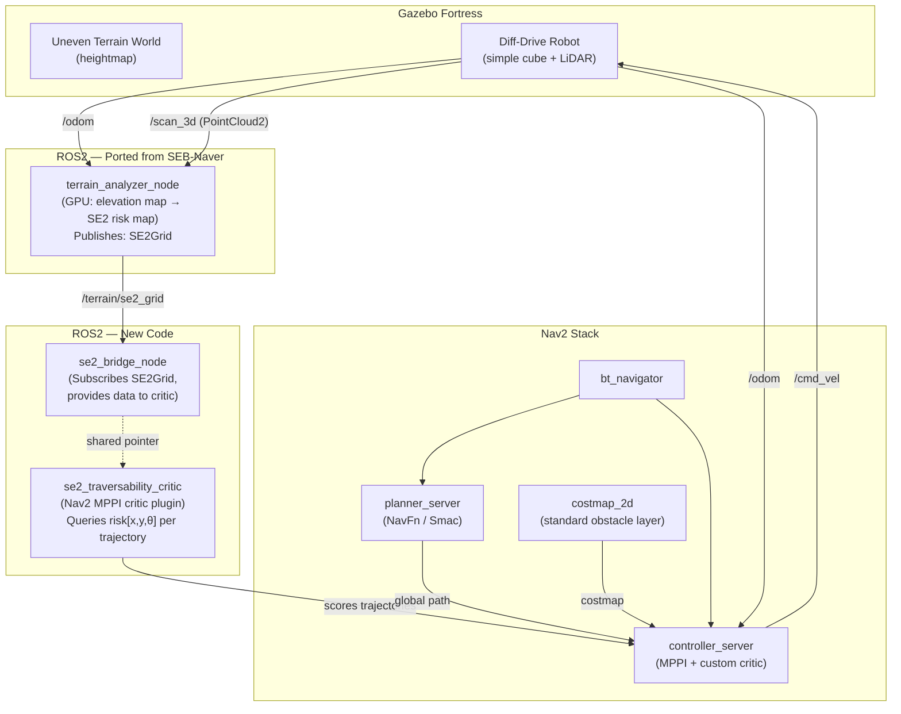

# Option B Implementation Plan: SE(2) Terrain Analyzer + Nav2 MPPI with Custom Critic

**Target Hardware:** Jetson AGX Orin (CUDA sm_87 — already matches the codebase!)  
**Robot:** Diff-drive (not Ackermann)  
**ROS2 Distro:** Humble  
**Simulation:** Gazebo Fortress via `ros_gz_bridge`

---

## Architecture Overview



### Key Design Decisions

1. **No CasADi needed** — Nav2 MPPI replaces both the custom planner and the MPC controller
2. **No Ackermann model** — MPPI natively supports diff-drive via its `DiffDrive` motion model  
3. **CUDA code stays untouched** — only the ROS wrapper (TerrainAnalyzer.cpp) gets ported
4. **sm_87 already set** — Jetson AGX Orin is compute capability 8.7, which is exactly what's in the CMakeLists.txt already
5. **Diff-drive footprint change** — The ellipsoid parameters (`ellipsoid_x: 0.4, ellipsoid_y: 0.3`) just need to be adjusted to match your robot's dimensions. The CUDA kernel is shape-agnostic — it evaluates risk in an elliptical region around any center point.

---

## Work Packages — Detailed Breakdown

### WP1: `se2_grid_core` + `se2_grid_msgs` (ROS2 Port)
**Effort: 3-4 hours**

These are the easiest — `se2_grid_core` has zero ROS dependency (Eigen only), and `se2_grid_msgs` is just message definitions.

#### [MODIFY] se2_grid_core/CMakeLists.txt
```diff
-find_package(catkin REQUIRED)
-catkin_package(INCLUDE_DIRS include LIBRARIES ${PROJECT_NAME})
+find_package(ament_cmake REQUIRED)
+find_package(Eigen3 REQUIRED)
+ament_export_include_directories(include)
+ament_export_libraries(${PROJECT_NAME})
+ament_package()
```

#### [MODIFY] se2_grid_core/package.xml
- Change `<buildtool_depend>catkin</buildtool_depend>` → `<buildtool_depend>ament_cmake</buildtool_depend>`

#### [MODIFY] se2_grid_msgs/CMakeLists.txt
- `find_package(catkin ...)` → `find_package(rosidl_default_generators REQUIRED)`
- `add_message_files(...)` + `generate_messages(...)` → `rosidl_generate_interfaces(...)`

#### [MODIFY] se2_grid_msgs/package.xml
- Standard catkin → ament conversion + add `rosidl_default_generators` dependency

---

### WP2: `se2_grid_ros` (ROS2 Port)
**Effort: 6-8 hours**

This is the ROS interface layer — converts SE2Grid ↔ ROS messages. Heavy ROS1 API usage.

#### [MODIFY] SE2GridRosConverter.cpp
Key changes:
| ROS1 | ROS2 |
|---|---|
| `#include <se2_grid_msgs/SE2Grid.h>` | `#include <se2_grid_msgs/msg/se2_grid.hpp>` |
| `ros::Time` | `rclcpp::Time` or `builtin_interfaces::msg::Time` |
| `saveToBag()` / `loadFromBag()` | **Delete** — or rewrite with `rosbag2_cpp` (not critical) |
| `sensor_msgs::PointCloud2` | `sensor_msgs::msg::PointCloud2` |
| `nav_msgs::OccupancyGrid` | `nav_msgs::msg::OccupancyGrid` |

#### Can skip for now
- `se2_grid_rviz_plugin` — Visualization can be done by publishing as PointCloud2 instead. Port later if needed.
- `se2_grid_tests` — Port after core works.

---

### WP3: `terrain_analyzer` (ROS2 Port)
**Effort: 1-2 days**

The biggest port, but the CUDA code (`TerrainBank.cu`) stays untouched. Only the C++ ROS wrapper needs changes.

#### [NO CHANGE] src/TerrainBank.cu
Nothing changes. This file has zero ROS includes. It compiles with `nvcc` and links as a static library. The CMakeLists.txt already handles CUDA via `project(terrain_analyzer CXX CUDA)`.

#### [MODIFY] src/TerrainAnalyzer.cpp — Key conversions

```diff
 // ROS1
-bool TerrainAnalyzer::init(ros::NodeHandle& nh)
+bool TerrainAnalyzer::init(rclcpp::Node::SharedPtr node)
 {
-    nh.getParam("/terrain_analyzer/elevation_map/resolution_pos", resolution_pos);
+    node->declare_parameter("elevation_map.resolution_pos", 0.1);
+    resolution_pos = node->get_parameter("elevation_map.resolution_pos").as_double();

     // Publishers
-    fused_pub = nh.advertise<se2_grid_msgs::SE2Grid>("fused_map", 1);
+    fused_pub = node->create_publisher<se2_grid_msgs::msg::SE2Grid>("fused_map", 1);

     // Subscribers
-    cloud_sub = nh.subscribe<sensor_msgs::PointCloud2>("cloud", 1, &TerrainAnalyzer::cloudCallback, this);
+    cloud_sub = node->create_subscription<sensor_msgs::msg::PointCloud2>(
+        "cloud", 1, std::bind(&TerrainAnalyzer::cloudCallback, this, std::placeholders::_1));

     // Timer
-    map_timer = nh.createTimer(ros::Duration(0.5), &TerrainAnalyzer::mapCallback, this);
+    map_timer = node->create_wall_timer(500ms, std::bind(&TerrainAnalyzer::mapCallback, this));

     // Odometry cache — message_filters works the same in ROS2
-    odom_sub.subscribe(nh, "odom", 1);
+    odom_sub.subscribe(node, "odom", rclcpp::QoS(1));
     odom_cache.connectInput(odom_sub);
 }
```

#### [MODIFY] src/terrain_analyzer_node.cpp

```diff
-#include <ros/ros.h>
+#include <rclcpp/rclcpp.hpp>

 int main(int argc, char** argv) {
-    ros::init(argc, argv, "terrain_analyzer");
-    ros::NodeHandle nh("~");
+    rclcpp::init(argc, argv);
+    auto node = std::make_shared<rclcpp::Node>("terrain_analyzer");

     terrain_analyzer::TerrainAnalyzer analyzer;
-    analyzer.init(nh);
-    ros::spin();
+    analyzer.init(node);
+    rclcpp::spin(node);
 }
```

#### [MODIFY] CMakeLists.txt — Hybrid ament + CUDA

```cmake
cmake_minimum_required(VERSION 3.5.1)
project(terrain_analyzer CXX CUDA)  # Keep CXX CUDA — this is CMake native, not catkin

find_package(ament_cmake REQUIRED)
find_package(rclcpp REQUIRED)
find_package(sensor_msgs REQUIRED)
find_package(se2_grid_core REQUIRED)
find_package(se2_grid_ros REQUIRED)
find_package(se2_grid_msgs REQUIRED)
find_package(OpenCV 4 REQUIRED)
find_package(Eigen3 REQUIRED)
find_package(pcl_conversions REQUIRED)
find_package(message_filters REQUIRED)

# CUDA — stays EXACTLY the same
set(CUDA_NVCC_FLAGS -gencode arch=compute_87,code=sm_87)  # AGX Orin ✓
add_library(cuda_computer src/TerrainBank.cu)
target_link_libraries(cuda_computer ${CUDA_LIBRARIES} ${OpenCV_LIBS})

# ROS2 library
add_library(${PROJECT_NAME}_library src/TerrainAnalyzer.cpp)
target_link_libraries(${PROJECT_NAME}_library cuda_computer)
ament_target_dependencies(${PROJECT_NAME}_library
  rclcpp sensor_msgs se2_grid_core se2_grid_ros se2_grid_msgs
  pcl_conversions message_filters OpenCV)

# Executable
add_executable(${PROJECT_NAME}_node src/terrain_analyzer_node.cpp)
target_link_libraries(${PROJECT_NAME}_node ${PROJECT_NAME}_library)

install(TARGETS ${PROJECT_NAME}_node DESTINATION lib/${PROJECT_NAME})
ament_package()
```

#### [MODIFY] post_processors — pluginlib changes
ROS2 `pluginlib` uses the same API as ROS1 with minor differences in the `plugin.xml` registration. Small change.

#### Diff-drive adaptation
The terrain analyzer's footprint is configured by these YAML parameters — no code changes needed:

```yaml
elevation_map:
  ellipsoid_x: 0.35   # half-length of your robot
  ellipsoid_y: 0.30   # half-width of your robot  
  ellipsoid_offset: [0.0, 0.0]  # was [0.13, 0] for rear-axle offset on Ackermann
  # For diff-drive, center of rotation is at robot center, so offset = [0,0]
```

---

### WP4: SE(2) Traversability MPPI Critic (New Code)
**Effort: 1-2 days**

This is the core new component. A Nav2 MPPI critic plugin that subscribes to the SE2Grid and scores trajectories by looking up `risk[x, y, θ]`.

#### [NEW] `se2_traversability_critic/include/se2_traversability_critic.hpp`

```cpp
#pragma once

#include <nav2_mppi_controller/critic_function.hpp>
#include <se2_grid_core/SE2Grid.hpp>
#include <se2_grid_msgs/msg/se2_grid.hpp>
#include <rclcpp/rclcpp.hpp>
#include <mutex>

namespace se2_critics
{

class SE2TraversabilityCritic : public mppi::critics::CriticFunction
{
public:
  void initialize() override;
  void score(mppi::CriticData & data) override;

private:
  void se2GridCallback(const se2_grid_msgs::msg::SE2Grid::SharedPtr msg);

  rclcpp::Subscription<se2_grid_msgs::msg::SE2Grid>::SharedPtr se2_grid_sub_;
  std::shared_ptr<se2_grid::SE2Grid> se2_grid_;
  std::mutex grid_mutex_;

  float weight_{1.0f};
  float collision_cost_{1e6f};
  unsigned int trajectory_point_step_{2};
  unsigned int power_{1};
};

}  // namespace se2_critics
```

#### [NEW] `se2_traversability_critic/src/se2_traversability_critic.cpp`

The key logic — for each MPPI trajectory, sample points and look up risk from the SE2Grid:

```cpp
void SE2TraversabilityCritic::score(mppi::CriticData & data)
{
  std::lock_guard<std::mutex> lock(grid_mutex_);
  if (!se2_grid_ || !se2_grid_->exists("risk")) return;

  auto & trajectories = data.trajectories;  // x: [batch, timesteps], y: [...], yaws: [...]
  auto & costs = data.costs;                // [batch] — we ADD our cost to this

  const auto batch_size = trajectories.x.rows();
  const auto time_steps = trajectories.x.cols();

  for (size_t i = 0; i < batch_size; i++) {
    float traj_cost = 0.0f;
    bool in_collision = false;

    for (size_t t = 0; t < time_steps; t += trajectory_point_step_) {
      float x = trajectories.x(i, t);
      float y = trajectories.y(i, t);
      float yaw = trajectories.yaws(i, t);

      // Look up risk in the SE(2) grid at (x, y, yaw)
      Eigen::Vector3d query(x, y, yaw);
      Eigen::Array3i index;

      if (se2_grid_->pos2Index(query, index)) {
        if (se2_grid_->isValid(index, {"risk"})) {
          float risk = se2_grid_->at("risk", index);
          if (risk >= 1.0f) {
            in_collision = true;
            break;
          }
          traj_cost += std::pow(risk, power_);
        }
      }
    }

    if (in_collision) {
      costs(i) += collision_cost_;
    } else {
      costs(i) += weight_ * traj_cost;
    }
  }
}
```

> [!NOTE]
> The `Trajectories` struct gives us `x`, `y`, and `yaws` arrays for all sampled trajectories — this is exactly what we need to query the SE(2) grid. Each MPPI batch has ~1000 trajectories × ~30 timesteps, and each SE2Grid lookup is O(1) (array index), so the critic runs fast.

#### [NEW] Plugin registration files
- `se2_traversability_critic_plugin.xml`
- `PLUGINLIB_EXPORT_CLASS` macro in the `.cpp`

#### Nav2 configuration (YAML)

```yaml
controller_server:
  ros__parameters:
    controller_frequency: 20.0
    FollowPath:
      plugin: "nav2_mppi_controller::MPPIController"
      motion_model: "DiffDrive"      # <-- diff-drive, not Ackermann
      batch_size: 1000
      time_steps: 30
      model_dt: 0.1
      vx_max: 1.0
      vy_max: 0.0                    # diff-drive: no lateral motion
      wz_max: 1.5
      critics:
        - "GoalCritic"
        - "GoalAngleCritic"
        - "PathAlignCritic"
        - "PathFollowCritic"
        - "PreferForwardCritic"
        - "SE2TraversabilityCritic"   # <-- our custom critic
      SE2TraversabilityCritic:
        plugin: "se2_critics::SE2TraversabilityCritic"
        weight: 5.0
        collision_cost: 100000.0
        trajectory_point_step: 2
        power: 1
        se2_grid_topic: "/terrain/se2_grid"
```

---

### WP5: Gazebo Simulation Setup
**Effort: 1-2 days**

#### [NEW] Robot URDF — Simple diff-drive cube with LiDAR

```xml
<!-- Minimal diff-drive robot -->
<robot name="terrain_bot">
  <link name="base_link">
    <visual><geometry><box size="0.5 0.4 0.2"/></geometry></visual>
    <collision><geometry><box size="0.5 0.4 0.2"/></geometry></collision>
    <inertial><mass value="5.0"/>...</inertial>
  </link>

  <!-- Left/Right wheels -->
  <link name="left_wheel">...</link>
  <link name="right_wheel">...</link>
  <joint name="left_wheel_joint" type="continuous">...</joint>
  <joint name="right_wheel_joint" type="continuous">...</joint>

  <!-- Caster for stability -->
  <link name="caster">...</link>

  <!-- 3D LiDAR -->
  <link name="lidar_link">...</link>
  <joint name="lidar_joint" type="fixed">
    <parent link="base_link"/>
    <child link="lidar_link"/>
    <origin xyz="0 0 0.15"/>
  </joint>

  <!-- Gazebo diff-drive plugin -->
  <gazebo>
    <plugin filename="libgazebo_ros_diff_drive.so" name="diff_drive">
      <ros><namespace>/</namespace></ros>
      <left_joint>left_wheel_joint</left_joint>
      <right_joint>right_wheel_joint</right_joint>
      <wheel_separation>0.4</wheel_separation>
      <wheel_diameter>0.1</wheel_diameter>
      <publish_odom>true</publish_odom>
      <publish_odom_tf>true</publish_odom_tf>
      <command_topic>cmd_vel</command_topic>
      <odometry_topic>odom</odometry_topic>
    </plugin>
  </gazebo>

  <!-- Gazebo 3D LiDAR plugin -->
  <gazebo reference="lidar_link">
    <sensor type="gpu_lidar" name="lidar">
      <topic>/scan_3d</topic>
      <update_rate>10</update_rate>
      <lidar>
        <scan><horizontal><samples>360</samples>...</horizontal>
              <vertical><samples>32</samples>
                <min_angle>-0.26</min_angle>
                <max_angle>0.26</max_angle>
              </vertical>
        </scan>
        <range><min>0.3</min><max>15.0</max></range>
      </lidar>
    </sensor>
  </gazebo>
</robot>
```

#### [NEW] Gazebo Uneven Terrain World

Use a heightmap DEM image to create uneven terrain:

```xml
<sdf version="1.8">
  <world name="uneven_terrain">
    <model name="terrain">
      <static>true</static>
      <link name="terrain_link">
        <collision name="terrain_collision">
          <geometry>
            <heightmap>
              <uri>file://terrain_heightmap.png</uri>
              <size>20 20 3</size>  <!-- 20m x 20m, 3m height range -->
              <pos>0 0 0</pos>
            </heightmap>
          </geometry>
        </collision>
        <visual name="terrain_visual">
          <geometry>
            <heightmap>
              <uri>file://terrain_heightmap.png</uri>
              <size>20 20 3</size>
              <pos>0 0 0</pos>
            </heightmap>
          </geometry>
        </visual>
      </link>
    </model>
  </world>
</sdf>
```

> [!TIP]
> You can generate test heightmaps using the same EPFL terrain generator the paper used: https://github.com/droduit/procedural-terrain-generation — or just create a simple grayscale PNG where pixel brightness = height.

#### [NEW] Launch file

```python
# launch/sim_with_nav2.launch.py
# Launches: Gazebo → robot spawn → terrain_analyzer → Nav2 stack
```

---

### WP6: Integration Wiring
**Effort: 1-2 days**

This is glue work — making sure all the topics, TF frames, and configs align.

| Connection | From | To | Topic/Frame |
|---|---|---|---|
| Point cloud | Gazebo LiDAR | terrain_analyzer | `/scan_3d` → remap to `~/cloud` |
| Odometry | Gazebo diff_drive | terrain_analyzer + Nav2 | `/odom` |
| SE2Grid | terrain_analyzer | MPPI critic | `/terrain/se2_grid` |
| cmd_vel | Nav2 MPPI | Gazebo diff_drive | `/cmd_vel` |
| TF | Gazebo | everyone | `odom → base_link` |
| Global plan | Nav2 planner | Nav2 MPPI | internal Nav2 |

#### Things to wire up
- ROS2 launch file composing all nodes
- Nav2 params YAML (costmap, planner, MPPI controller config)
- `ros_gz_bridge` config to bridge Gazebo ↔ ROS2 topics
- TF tree: `map → odom → base_link → lidar_link`
- For global planning: a simple 2D costmap from the SDF layer (flatten the obstacle info to a standard `OccupancyGrid`)

---

### WP7: Testing & Tuning
**Effort: 2-3 days**

1. **Unit test terrain analyzer**: Feed a known PCD heightmap, verify elevation/risk output
2. **Unit test MPPI critic**: Create a synthetic SE2Grid, verify trajectory scoring
3. **Integration test in Gazebo**: Drive the robot through uneven terrain, verify:
   - Terrain analyzer publishes SE2Grid at ~10Hz
   - MPPI avoids high-risk areas
   - Robot navigates to goals without flipping
4. **Tune MPPI weights**: The `SE2TraversabilityCritic.weight` relative to other critics (GoalCritic, PathAlignCritic, etc.) needs balancing

---

## Complete File Manifest

### Ported packages (from SEB-Naver)

| Package | Files to modify | Files unchanged |
|---|---|---|
| `se2_grid_core` | `CMakeLists.txt`, `package.xml` | All `.hpp`/`.cpp` source files |
| `se2_grid_msgs` | `CMakeLists.txt`, `package.xml` | `.msg` files (same syntax) |
| `se2_grid_ros` | `CMakeLists.txt`, `package.xml`, all `.cpp`/`.hpp` | — |
| `terrain_analyzer` | `CMakeLists.txt`, `package.xml`, `TerrainAnalyzer.cpp`, `terrain_analyzer_node.cpp`, `post_processors.cpp` | **`TerrainBank.cu`** (unchanged!) |

### New packages

| Package | Files | Purpose |
|---|---|---|
| `se2_traversability_critic` | `critic.hpp`, `critic.cpp`, `plugin.xml`, `CMakeLists.txt`, `package.xml` | Custom MPPI critic |
| `terrain_bot_description` | `robot.urdf.xacro`, `terrain_world.sdf` | Robot model + Gazebo world |
| `terrain_bot_bringup` | `sim_with_nav2.launch.py`, `nav2_params.yaml`, `terrain_analyzer_params.yaml` | Launch + config |

### Packages DROPPED entirely

| Package | Reason |
|---|---|
| `tank_slam/` (FAST_LIO, Livox drivers, EKF) | Gazebo provides odom |
| `tank_sdk/` | Hardware driver, replaced by Gazebo diff_drive |
| `simulator/` (fake_ugv, laser_sim, map_gen) | Replaced by Gazebo |
| `mpc_controller/` | Replaced by Nav2 MPPI |
| `planner/` (arc_planner, path_search, decomp_rviz) | Replaced by Nav2 planner + MPPI |
| `se2_grid_rviz_plugin` | Skip for now, visualize via PointCloud2 |
| `se2_grid_tests` | Port later |

---

## Timeline Summary

| WP | Task | Effort | Dependencies |
|---|---|---|---|
| **WP1** | Port `se2_grid_core` + `se2_grid_msgs` | 3-4 hours | None |
| **WP2** | Port `se2_grid_ros` | 6-8 hours | WP1 |
| **WP3** | Port `terrain_analyzer` | 1-2 days | WP1, WP2 |
| **WP4** | Build MPPI critic plugin | 1-2 days | WP1, WP2 |
| **WP5** | Gazebo sim setup (robot + terrain) | 1-2 days | None (parallel) |
| **WP6** | Integration wiring + launch | 1-2 days | WP3, WP4, WP5 |
| **WP7** | Testing + tuning | 2-3 days | WP6 |
| | **Total** | **~2-3 weeks** | |

> [!IMPORTANT]
> WP4 and WP5 can be done **in parallel** with WP1-WP3. And WP5 (Gazebo setup) has no dependency on the SEB-Naver code at all — you could start there today.

---

## Risk Mitigation

> [!WARNING]
> ### Biggest risk: `message_filters` odometry cache in ROS2
> The terrain analyzer uses `message_filters::Cache` to time-synchronize LiDAR point clouds with odometry. The ROS2 `message_filters` package supports this, but the API has subtle differences. If this causes issues, fallback is to simply use the latest odometry in a regular subscriber callback (slight timing error but usually fine in simulation).

> [!WARNING]
> ### Gazebo heightmap → terrain analyzer alignment
> The terrain analyzer builds its own elevation map from raw LiDAR returns. The Gazebo heightmap generates the physical terrain. These are independent — the LiDAR scans the Gazebo terrain and the analyzer builds its own map from those scans. This should "just work" but the LiDAR needs enough vertical FOV to see the ground (configured in the sensor plugin).

> [!TIP]
> ### Diff-drive vs Ackermann simplification
> Switching to diff-drive actually **simplifies** things. The Ackermann model had nonholonomic constraints (minimum turning radius, rear-axle steering geometry) that the custom planner handled carefully. Diff-drive robots can turn in place, so Nav2 MPPI's `DiffDrive` motion model handles this trivially. The traversability assessment doesn't care about the drive type — it evaluates terrain risk based on the robot's footprint and heading, which works identically for both.
